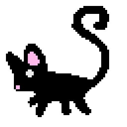

# About Me

- [About Me](#about-me)
  - [Introduction](#introduction)
    - [I'm looking forward to ...](#im-looking-forward-to-)

## Introduction

Well met, I'm Emma. I've been in love with programming since I was in primary school. My other loves are reading (books, manga, comics, magazines, anything I can get my hands on) and doing digital art.

I'm trying to learn pixel art and here's my five minute adventure in [Aesprite](https://www.aseprite.org/)!

### I'm looking forward to ...

1. Learning Typescript!
   - And how its being used in GitHub to do tests!
2. Babylon.js API
3. Creating a narrative in our XR projects