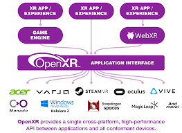

# Formative Quiz

- [Formative Quiz](#formative-quiz)
  - [Disclaimer](#disclaimer)
  - [Question 01](#question-01)
  - [Question 02](#question-02)
  - [Question 03](#question-03)
  - [Question 04](#question-04)
  - [Question 05](#question-05)
  - [Question 06](#question-06)
  - [Question 07](#question-07)
  - [Question 08](#question-08)
  - [Question 09](#question-09)
  - [Question 10](#question-10)
  - [Question 11](#question-11)

## Disclaimer

Compiled. I do not know if the answers are correct, though.

## Question 01

**Rank the tools from the most accessible (for developers without coding experience) to the least.**

- Unity
- CoSpaces
- OpenXR SDK in C++

**Answer**

Most Accessible

1. CoSpaces
2. Unity
3. OpenXR SDK in C++

Least Accessible

## Question 02

**You need to implement a cross-platform native VR experience using a novel hand tracking algorithm and you want to focus on implementing VR components with the same underlying codebase across Meta's Quest HMDs, HTC's Vive HMDs, Google Cardboard. You hope to align it to an open standard so that there is a vibrant developer ecosystem and that the underlying tooling will be constantly improved. What standard should you be using?**

- OpenXR
- Vulkan
- WebGL
- WebXR
- OpenGL
- OpenCL

**Answer**

`OpenXR`



Image from: [Snapdragon Spaces Platform](https://docs.spaces.qualcomm.com/platform/architecture/openxr-for-snapdragon-spaces)

## Question 03

**You are introduced a new "/components" directory containing new source files that are part of your Babylon.js project. Which file should you modify to make sure your web app still runs?**

- tsconfig.json
- package-lock.json
- main.ts
- package.json
- index.html
- app.ts

**Answer**

`tsconfig.json`

- [What is a tsconfig.json?](https://www.typescriptlang.org/docs/handbook/tsconfig-json.html)
- [What is a package-lock.json and package.json?](https://www.geeksforgeeks.org/difference-between-package-json-and-package-lock-json-files/)
- `index.html` is a the project's template file for our HTML plugin to create for the app.
- `index.ts` is generally the entry point for our app.
- `app.ts` is a code file.

## Question 04

**In your WebXR typescript-based app, you have edited a file in your project directory to specify that Babylon.js version should be 7.3.0. After running `npm install`, a file will be automatically updated in your project directory. Name the file in your project directory that will be updated.**

**Answer**

`package-lock.json`

Note that `node_modules/` should also be updated to reflect this dependency.

- `npm install` [command](https://www.geeksforgeeks.org/npm-install-command/)

## Question 05

*(recreated to the best I could)*

**The line
`app.createScene().then(scene => {` is undefined. What keyword would you add to the code block so that this line will no longer be undefined.**

Code Block:
```
import { Engine, Scene } from "@babylonjs/core";

export class App
{
    private engine: Engine;

    constructor(engine: Engine)
    {
        this.engine = engine;
    }

    createScene()
    {
        // creates a scene
        // ...
        // assume no compilation error here
        return scene;
    }
}

// get the canvas element
const canvas = <HTMLCanvasElement>document.getElementById('renderCanvas');

// initialize babylon engine
const engine = new Engine(canvas, true);

// create the scene and run the render loop
const app = new App(engine);
app.createScene().then(scene => {
    engine.runRenderLoop(() => {
        scene.render();
    })
});
```

**Answer**

`async` on `App::createScene` as `.then` is used to resolve [promises](https://www.w3schools.com/js/js_promise.asp).

## Question 06

**In IPA1, the **package.json** looks like this. You want to deploy your Babylon.js to a web server. What should you run in the terminal to get the files to deploy?**

**package.json**
```
{
  "name": "hello-immersive",
  "private": true,
  "version": "0.0.0",
  "type": "module",
  "scripts": {
    "dev": "vite",
    "build": "tsc && vite build",
    "preview": "vite preview",
    "test": "vitest --reporter=verbose",
    "test:ui": "vitest --ui",
    "test:run": "vitest --run",
    "clean": "rm -rf dist node_modules package-lock.json"
  },
  "devDependencies": {
    "@vitest/ui": "^2.1.8",
    "typescript": "^5.7.2",
    "vite": "^6.0.3",
    "vitest": "^2.1.8"
  },
  "dependencies": {
    "@babylonjs/core": "^6.36.1",
    "babylon": "^6.18.0"
  }
}
```

- `npm run test`
- `npm run build`
- `npm run vite`
- `npm run dev`
- `npm run preview`

**Answer**

`npm run dev` will deploy the files to the web server.

What the other answers do:
- `npm run test`
- - runs the test environment.
- - autodetects any changes in the files, then recompiles automatically to apply those changes, then runs the test cases on them.
- - does not deploy to the web server.
- `npm run build`
- - building and bundling the project for production
- - does not deploy but creates the build (think of it like the .exe is created but not run).
- `npm run vite`
- - No such command available.
- - None of the keys in object `"scripts"` is `"vite"`.
- - `vite` is a library that automates building the files for production.
- `npm run preview`
- - `npm run build` must be run before this. Otherwise it will prompt `Error: The directory "dist" does not exist. Did you build your project?`
- - Once `build` has been run, this will deploy to the web server.

## Question 07

**Where is `createScene(...)` usually defined?**

- app.ts
- index.html
- package-lock.json
- tsconfig.json
- package.json

**Answer**

`app.ts`

The other files are not code files at all.

## Question 08

**Which file should you add to your team's version control if you want the project dependencies to have the same exact versions across your team?**

- package.json
- package-lock.json
- index.html
- app.ts
- tsconfig.json

**Answer**

`package-lock.json`

## Question 09

**You want to add a custom script as part of your Babylon.js project test workflow. Which file should you modify?**

- package.json
- tsconfig.json
- app.ts
- index.html
- package-lock.json

**Answer**

`package.json` under `"scripts"` object. It is usually a third party library that automates the testing workflow (such as `vite`).

(tsconfig.json specifies compiler options and does not control testing workflow.)

## Question 10

**When connecting the Meta Quest 2, there is no prompt to enable connection and I can't see the developer options in the settings. What is the likely issue?**

- Did not enable Developer Mode on the Meta Horizon app on the phone
- Headset is in low power mode
- Did not tap the Build Number 7 times in the settings
- Did not connect a USB data cable from the PC to the headset

**Answer**

`Did not enable Developer Mode on the Meta Horizon app on the phone`

- Headset is in low power mode
- - Inconsequential.
- Did not tap the Build Number 7 times in the settings
- - Android phone.
- Did not connect a USB data cable from the PC to the headset
- - "when connecting" in the question implies that a USB cable has been attached. This is necessary for development, but no developer options presents more of a problem.

## Question 11

**What does the following Babylon.js snippet accomplish?**

```
const xr = await scene.createDefaultXRExperienceAsync({
    uiOptions: {
        sessionMode: "immersive-vr",
    },
});
```

- Makes a non-blocking method call to initialize typical components for VR experiences.
- Creates a default BabylonJS scene with a sphere and cube.
- Creates a default BabylonJS scene with a sphere and plane, and then initializes typical components for VR experiences.
- Initializes typical components for hybrid XR (AR & VR) experience.

**Answer**

`Makes a non-blocking method call to initialize typical components for VR experiences.`

Tutorial: https://doc.babylonjs.com/features/featuresDeepDive/webXR/introToWebXR

Noting that this `createDefaultXRExperienceAsync` is invoked by `scene`, that means `scene` holds all the scene information. This strikes out any option that creates a default BabylonJS scene.